# Dimension reduction report — graded-pbmc3k

## 1. Dataset profile

<!-- drtools:profile sha256=4864dd91ac2796af -->
| Property | Value |
|---|---|
| Dataset | pbmc3k (`pbmc3k`, scanpy.datasets.pbmc3k) |
| Modality | scRNA-seq |
| Samples | 2700 |
| Features | 32738 |
| Storage | sparse_csr, float32, 18.31 MB |
| Sparsity | 0.9741 |
| Values | counts |
| Identity | `673489610014` |
| Labels | none |

- {'observation': '32,738 features against 2,700 samples. In this regime pairwise Euclidean distances concentrate and neighbour graphs become unreliable, so a linear reduction before any neighbour-based method is close to mandatory.', 'evidence': ['profile.shape.n_features', 'profile.shape.n_samples', 'profile.shape.aspect_ratio']}
- {'observation': '97% of entries are exactly zero. Zero inflation makes raw Euclidean distance a poor similarity: two samples can agree on every measured feature and still sit far apart because they share few non-zeros. Held sparsely at 18 MB; densifying it would take 354 MB, so stages that require dense input are a memory decision, not just a formatting one.', 'evidence': ['profile.values.sparsity', 'profile.shape.storage']}
- {'observation': 'Values are non-negative integers, i.e. count data. Counts are heteroscedastic — variance grows with the mean — so a variance-stabilising transform such as log1p belongs before any Euclidean-distance method.', 'evidence': ['profile.values.is_integer_valued', 'profile.values.is_nonnegative']}
- {'observation': 'Sample totals vary 29-fold across the dataset. Without per-sample normalisation, the leading variation in any distance-based embedding will be total magnitude rather than profile shape.', 'evidence': ['profile.samples.total_ratio_max_min']}
- {'observation': 'Every non-constant column is whole-numbered, which counts of one type would also produce; it does not by itself mean the features are of mixed types.', 'evidence': ['profile.features.column_kinds']}
- {'observation': '16,104 features are constant and carry no information; they should be dropped before scaling, which would otherwise divide by zero.', 'evidence': ['profile.features.n_constant']}
- {'observation': 'No labels. Label-based evaluation is unavailable unless reference labels are derived, which would make those metrics a measure of agreement with the clustering rather than with truth.', 'evidence': ['profile.labels.present']}
<!-- /drtools:profile -->

The data are the 10x Genomics peripheral blood mononuclear cell set: unique molecular identifier (UMI) counts of genes in single cells. Three facts from the profile shaped everything after it. First, the features far outnumber the cells, so distances in the raw feature space concentrate, and a linear reduction has to come before any method that builds a neighbourhood graph. Second, the matrix is almost entirely zeros, and about half its columns are constant. Third, sample totals vary many-fold, so without normalisation the leading axis of variation would be sequencing depth rather than cell identity. There are no labels, so the Battery is unsupervised: trustworthiness, continuity and the Shepard correlation, all measured against the Reference.

## 2. Preprocessing decisions, and why

<!-- drtools:preprocessing sha256=7890489a58b83829 -->
Data decision: values `raw_counts`, features `one_type`, decided by agent, citing `profile.values.suspected_kind`, `profile.values.is_integer_valued`, `profile.values.is_nonnegative`, `profile.value_kind_declared`, `profile.modality`, `profile.features.column_kinds`, `profile.features.names_head`.

The base follows the rule for that decision.

Base preprocessing, applied to every Candidate and to the reference:

1. `drop_constant`
2. `normalise_total`
3. `log1p`

By rule, the 2,000 most variable features are kept and z-scored before the method in `pca-laplacian`, `pca-isomap`, `pca-diffusion`: with more than 2,000 features of one type, a method working through Euclidean distances selects by variance. The Linear baseline never selects; the Selected baseline, `selected-pca`, is the same PCA behind the same selection. With the preprocessing held fixed, a selecting Candidate's difference from the Selected baseline is its method's, and the Selected baseline's difference from the Linear baseline is the selection and z-score's -- but only where the two share a d. At different d, each difference is also the dimension's.

The values were judged to be raw counts, so each sample was rescaled to the median total (2,197) and then transformed by log(1 + x). Data already transformed should be declared as such when the analysis starts, or supplied transformed.
<!-- /drtools:preprocessing -->

Both facts behind the preprocessing were decided by the agent from the profile, and neither was left to a default. The values are raw counts: they are non-negative integers, the loader declares them as raw UMI counts, and the profile's own test suspects counts. The features are of one type: every column is a gene from one assay. Some columns look binary only because those genes are rarely detected. That is sparsity, not a different measurement type. The run was under `--auto`, so the raw-counts statement was written to the Decision log rather than shown to a user before registration.

Two comparisons are built into the portfolio, and they measure different things. The first is `selected-pca` against `pca`. It measures the effect of selecting 2,000 variable genes and z-scoring them, but only if the two share a d, which they do not here (section 4). A second difference also separates them. `pca` ran on the sparse Reference, where the toolbox uses an SVD without centring, so its leading component partly tracks cell magnitude. `selected-pca` ran on dense, standardised input and is a true centred PCA. The second comparison is each nonlinear Candidate against `selected-pca`. The preprocessing is the same, so it measures the method, but again only at a shared d.

## 3. Methods selected and rejected

<!-- drtools:methods sha256=db2af6b948a926a9 -->
**Selected**

| Candidate | Pipeline | Why |
|---|---|---|
| pca | `pca` | Linear baseline on the full normalised, log-transformed Reference. Every nonlinear Candidate is measured against it. PCA extends exactly to new cells, and its components are interpretable as gene loadings. |
| selected-pca | `select_variable_features` -> `standardise` -> `pca` | Selected baseline required by the feature-selection rule. It separates the effect of selecting 2,000 variable genes from the effect of the nonlinear methods that follow the same selection. |
| pca-laplacian | `select_variable_features` -> `standardise` -> `pca` -> `laplacian_eigenmaps` | Local-structure Candidate. The k=15 neighbourhood graph is a single connected component, so the Laplacian's eigenvectors are coordinates rather than indicators of components. The 32,738 features against 2,700 cells make a linear pre-step necessary before any neighbour graph is built. |
| pca-isomap | `select_variable_features` -> `standardise` -> `pca` -> `isomap` | Global-structure Candidate. Variance is spread over far more than 50 linear components, which is the regime where geodesic distance may describe the data better than straight-line distance. Isomap needs a connected graph, which recon found, and n = 2,700 is within its scaling limit of 5,000. |
| pca-diffusion | `select_variable_features` -> `standardise` -> `pca` -> `diffusion_maps` | Second global Candidate, from the diffusion family. Diffusion distance averages over all paths, so it is robust to the noise of sparse counts (97% zeros). Density varies only about 2-fold across the neighbourhood graph, so alpha = 1 density normalisation has a stable operator to act on. n = 2,700 is within the dense-kernel limit of 10,000. |

**Rejected**

| Method | Why not | Evidence |
|---|---|---|
| mds | Metric MDS reproduces the ambient Euclidean distances. With 32,738 features against 2,700 cells and an intrinsic dimension near 24, those distances concentrate, and MDS would faithfully reproduce the concentration. It cannot place new rows. PCA and Isomap already cover the global-distance objective: PCA for straight-line distance, Isomap for geodesic distance. | `profile.shape.aspect_ratio`, `recon.intrinsic_dimension.twonn`, `profile.shape.n_samples` |
| lle | The local-structure family is already covered by Laplacian eigenmaps on the same connected graph. LLE's neighbour minimum grows with d. With an intrinsic dimension near 24, tuning may choose a large d, and the standard variant is the least stable when the local weight problem is ill-conditioned. | `recon.intrinsic_dimension.twonn`, `recon.neighbourhood.n_connected_components` |
| sparse_pca | Sparse PCA assumes the signal is carried by a small subset of features, but the probe's variance is spread thinly across many components: 50 components reach only about 21% cumulative variance. It also needs dense input, and its non-orthogonal components cannot be read like PCA's. The Selected baseline already tests whether restricting to fewer features helps. | `recon.spectrum.probe.cumulative`, `profile.values.sparsity` |
| kernel_pca | The kernel choice matters more than its tuning, and the profile gives nothing that argues for a particular kernel. Diffusion maps already cover kernel-based spectral geometry, with a bandwidth chosen by a stated criterion and density normalisation. Neighbourhood density varies only about 2-fold, so a single global RBF width adds little over the diffusion kernel. | `recon.neighbourhood.density_ratio_p95_p05`, `profile.shape.n_samples` |
<!-- /drtools:methods -->

The portfolio covers one Linear baseline, one local-structure method (Laplacian eigenmaps) and two global-structure methods from different families: Isomap, which uses geodesic distances along a graph, and diffusion maps, which uses diffusion distance. The Selected baseline is added on top, as the feature-selection rule requires. The eligible Reductions that did not run were each rejected for a stated reason. One reason was redundancy. LLE overlaps Laplacian eigenmaps in the local family, and kernel PCA overlaps diffusion maps in kernel-based spectral geometry. Another was a mismatched assumption. Sparse PCA assumes a few features carry the signal, but the spectrum spreads variance thinly over many components. The third was the geometry of the data. MDS would faithfully reproduce the distance concentration of a space this wide, and it cannot place new cells. No method was rejected for scale alone: at this sample size every eligible Reduction was within its scaling limit.

The Visualization methods (t-SNE, UMAP, PHATE, PaCMAP, TriMap) are excluded by rule, because this is a Representation run. UMAP appears in section 5 only as plot B, a fixed-setting picture of each representation that is not scored.

The registered Plan passed validation on its first submission, so no refusal is recorded. Every Candidate produced an Embedding on its first attempt, and the one re-plan round was not used. The results showed no structure that the portfolio had not been shaped to capture.

## 4. Hyperparameter choices, and why

<!-- drtools:hyperparameters sha256=d930c7cdcf3f9326 -->
**pca**

| Stage | Parameter | Value | Source |
|---|---|---|---|
| `normalise_total` | `target` | None | registry_default |
| `pca` | `n_components` | 4 | tuned |
| `pca` | `whiten` | False | registry_default |

Tuned: d = 4, chosen by the elbow rule on its curve of cumulative explained variance.

**selected-pca**

| Stage | Parameter | Value | Source |
|---|---|---|---|
| `normalise_total` | `target` | None | registry_default |
| `select_variable_features` | `n_features` | 2000 | specified |
| `pca` | `n_components` | 83 | tuned |
| `pca` | `whiten` | False | registry_default |

Tuned: d = 83, chosen by the fallback rule on its curve of cumulative explained variance.

**pca-laplacian**

| Stage | Parameter | Value | Source |
|---|---|---|---|
| `normalise_total` | `target` | None | registry_default |
| `select_variable_features` | `n_features` | 2000 | specified |
| `pca` | `n_components` | 83 | tuned |
| `pca` | `whiten` | False | registry_default |
| `laplacian_eigenmaps` | `n_components` | 4 | tuned |
| `laplacian_eigenmaps` | `n_neighbors` | 15 | tuned |

Tuned: d = 4, chosen by the eigengap rule on its curve of eigengap after d; `n_neighbors` = 15, 1 times the suggestion of 15 at 2,000 rows.

**pca-isomap**

| Stage | Parameter | Value | Source |
|---|---|---|---|
| `normalise_total` | `target` | None | registry_default |
| `select_variable_features` | `n_features` | 2000 | specified |
| `pca` | `n_components` | 83 | tuned |
| `pca` | `whiten` | False | registry_default |
| `isomap` | `n_components` | 7 | tuned |
| `isomap` | `n_neighbors` | 20 | tuned |

Tuned: d = 7, chosen by the elbow rule on its curve of 1 - residual variance; `n_neighbors` = 20, 2 times the suggestion of 10 at 2,000 rows, at the edge of the multiplier grid, so a value beyond it might score higher.

**pca-diffusion**

| Stage | Parameter | Value | Source |
|---|---|---|---|
| `normalise_total` | `target` | None | registry_default |
| `select_variable_features` | `n_features` | 2000 | specified |
| `pca` | `n_components` | 83 | tuned |
| `pca` | `whiten` | False | registry_default |
| `diffusion_maps` | `n_components` | 5 | tuned |
| `diffusion_maps` | `epsilon` | None | tuned |
| `diffusion_maps` | `alpha` | 1.0 | registry_default |
| `diffusion_maps` | `t` | 1 | tuned |
| `diffusion_maps` | `width_multiplier` | 1.0 | tuned |

Tuned: d = 5, chosen by the elbow rule on its curve of share of diffusion distance kept; `epsilon` at 1 times the width the executor's rule computes.
<!-- /drtools:hyperparameters -->

No value was overridden. Each tuned parameter was centred on the toolbox's Suggestion or rule, and each d was chosen by its method's own criterion (the curves are in section 5).

Three tuning outcomes need a reader's attention:

- **The PCA pre-step found no elbow on the selected genes.** Its cumulative explained-variance curve rises almost linearly, so the criterion fell back to its fallback rule and was capped. The same large PCA dimension therefore feeds every nonlinear Candidate, and it is the Winner's d. A curve this flat says that no small linear subspace holds most of the variance of the selected, standardised genes. The high two-NN estimate on the probe representation says the same.
- **Isomap's neighbourhood size lies at the edge of its grid.** The tuning chose the largest multiplier offered, so a larger graph might score higher. The smallest multiplier was infeasible, because its graph split into disconnected components. Isomap has no geodesic distance between components, so that cell could not be fitted at all.
- **Diffusion maps' bandwidth was set by the connectivity floor.** The narrowest multiplier made the kernel isolate individual cells and was refused. At the chosen multiplier, the stage record shows the bandwidth was doubled several times before the kernel stopped isolating cells. Diffusion time t = 1 scored best. Longer times chose d = 2 and scored lower.

## 5. Figures

<!-- drtools:figures sha256=f24aecb7b15f387f -->
**comparison**

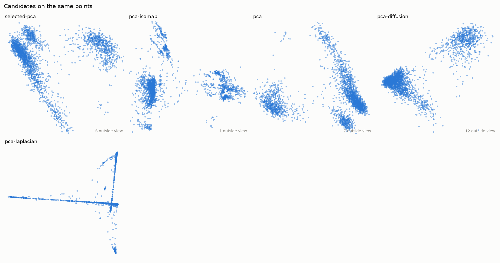

**embedding_selected-pca**

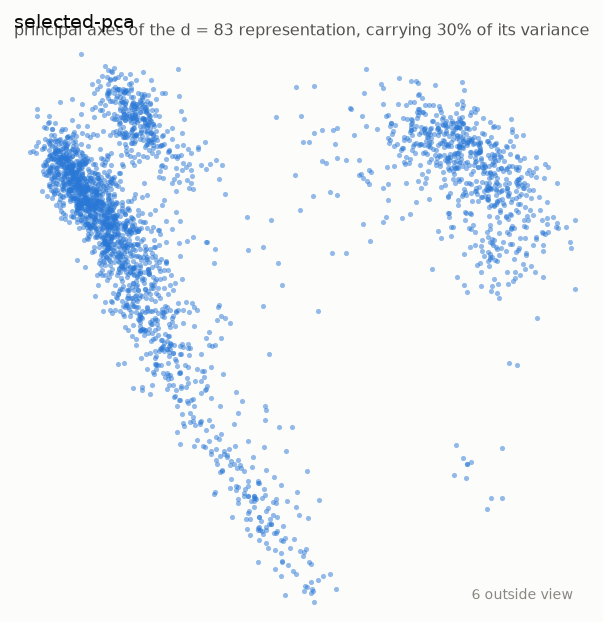

_Plot A: the d = 83 representation on its first two principal axes, which carry 30% of its variance. A rotation, so the distances within those two axes are the representation's own; the variance beyond them is not shown._

_Identity is carried by none in this figure._

**plot_b_selected-pca**

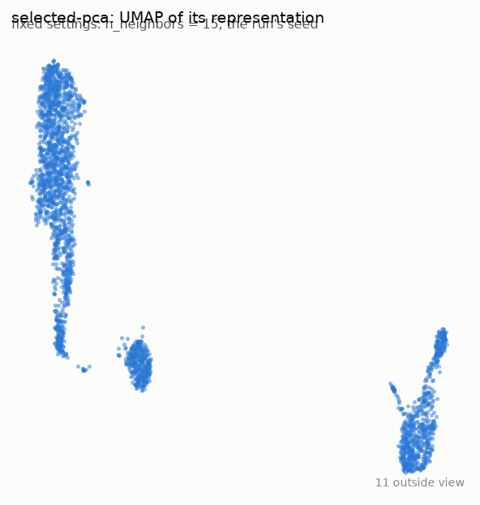

_Plot B: umap of the representation at the same fixed settings for every candidate (n_neighbors = 15, the run's seed). A picture of the representation, not the representation, and not scored._

_How to read a umap picture. Distances: Distances between groups are kept better than by t-SNE but are still not to scale. Within a group, neighbourhood membership is what is kept. Gaps: The width of a gap does not measure dissimilarity; min_dist and the graph's connectivity shape it. Sizes: Local distances are normalised point by point, so density is largely lost and a group's size says little about its spread._

_Identity is carried by none in this figure._

**embedding_pca-isomap**

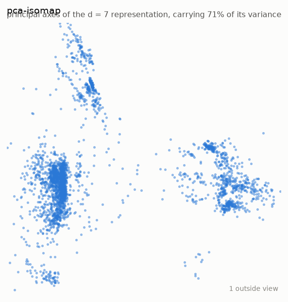

_Plot A: the d = 7 representation on its first two principal axes, which carry 71% of its variance. A rotation, so the distances within those two axes are the representation's own; the variance beyond them is not shown._

_Identity is carried by none in this figure._

**plot_b_pca-isomap**

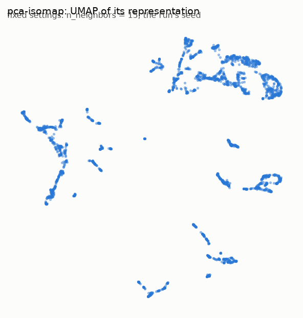

_Plot B: umap of the representation at the same fixed settings for every candidate (n_neighbors = 15, the run's seed). A picture of the representation, not the representation, and not scored._

_How to read a umap picture. Distances: Distances between groups are kept better than by t-SNE but are still not to scale. Within a group, neighbourhood membership is what is kept. Gaps: The width of a gap does not measure dissimilarity; min_dist and the graph's connectivity shape it. Sizes: Local distances are normalised point by point, so density is largely lost and a group's size says little about its spread._

_Identity is carried by none in this figure._

**embedding_pca**

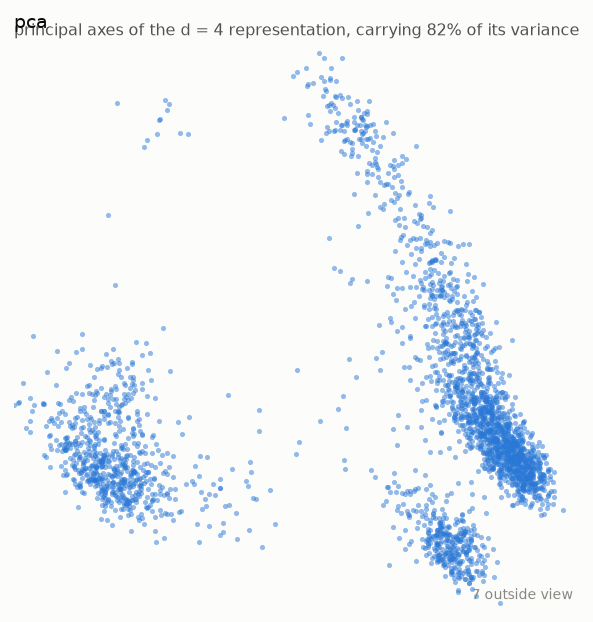

_Plot A: the d = 4 representation on its first two principal axes, which carry 82% of its variance. A rotation, so the distances within those two axes are the representation's own; the variance beyond them is not shown._

_Identity is carried by none in this figure._

**plot_b_pca**

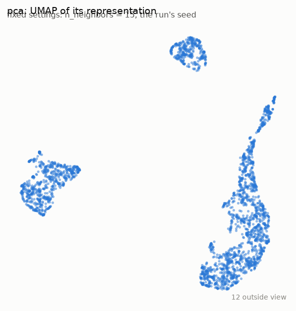

_Plot B: umap of the representation at the same fixed settings for every candidate (n_neighbors = 15, the run's seed). A picture of the representation, not the representation, and not scored._

_How to read a umap picture. Distances: Distances between groups are kept better than by t-SNE but are still not to scale. Within a group, neighbourhood membership is what is kept. Gaps: The width of a gap does not measure dissimilarity; min_dist and the graph's connectivity shape it. Sizes: Local distances are normalised point by point, so density is largely lost and a group's size says little about its spread._

_Identity is carried by none in this figure._

**embedding_pca-diffusion**

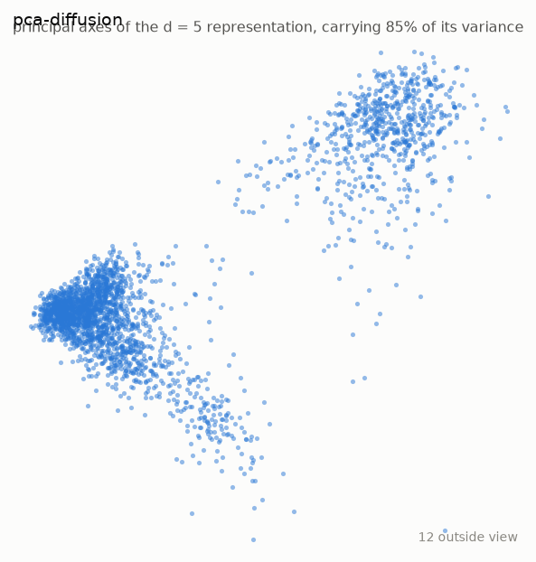

_Plot A: the d = 5 representation on its first two principal axes, which carry 85% of its variance. A rotation, so the distances within those two axes are the representation's own; the variance beyond them is not shown._

_Identity is carried by none in this figure._

**plot_b_pca-diffusion**

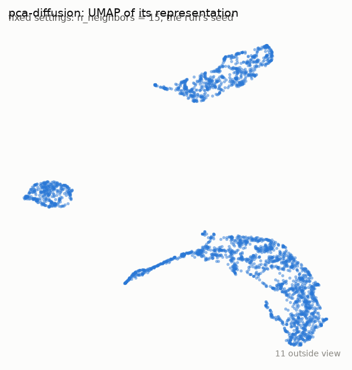

_Plot B: umap of the representation at the same fixed settings for every candidate (n_neighbors = 15, the run's seed). A picture of the representation, not the representation, and not scored._

_How to read a umap picture. Distances: Distances between groups are kept better than by t-SNE but are still not to scale. Within a group, neighbourhood membership is what is kept. Gaps: The width of a gap does not measure dissimilarity; min_dist and the graph's connectivity shape it. Sizes: Local distances are normalised point by point, so density is largely lost and a group's size says little about its spread._

_Identity is carried by none in this figure._

**embedding_pca-laplacian**

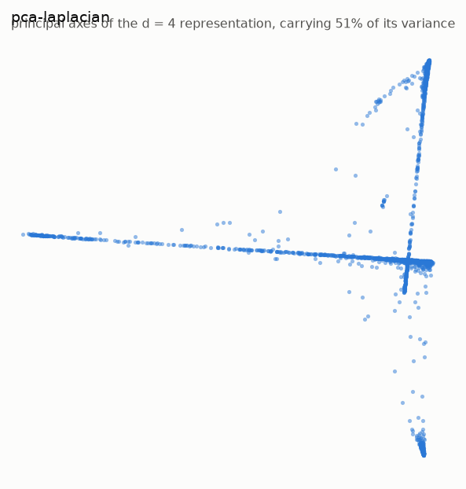

_Plot A: the d = 4 representation on its first two principal axes, which carry 51% of its variance. A rotation, so the distances within those two axes are the representation's own; the variance beyond them is not shown._

_Identity is carried by none in this figure._

**plot_b_pca-laplacian**

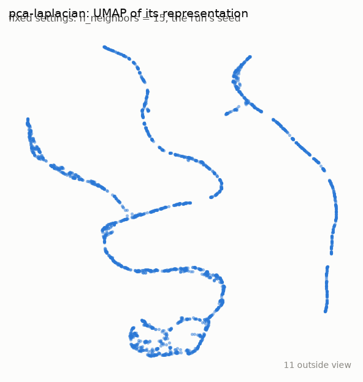

_Plot B: umap of the representation at the same fixed settings for every candidate (n_neighbors = 15, the run's seed). A picture of the representation, not the representation, and not scored._

_How to read a umap picture. Distances: Distances between groups are kept better than by t-SNE but are still not to scale. Within a group, neighbourhood membership is what is kept. Gaps: The width of a gap does not measure dissimilarity; min_dist and the graph's connectivity shape it. Sizes: Local distances are normalised point by point, so density is largely lost and a group's size says little about its spread._

_Identity is carried by none in this figure._

**shepard**

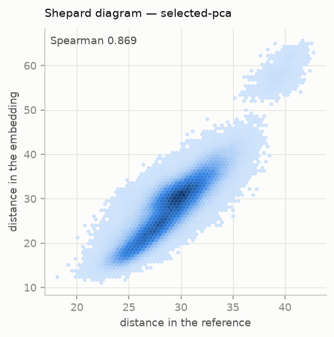

**d_curves**

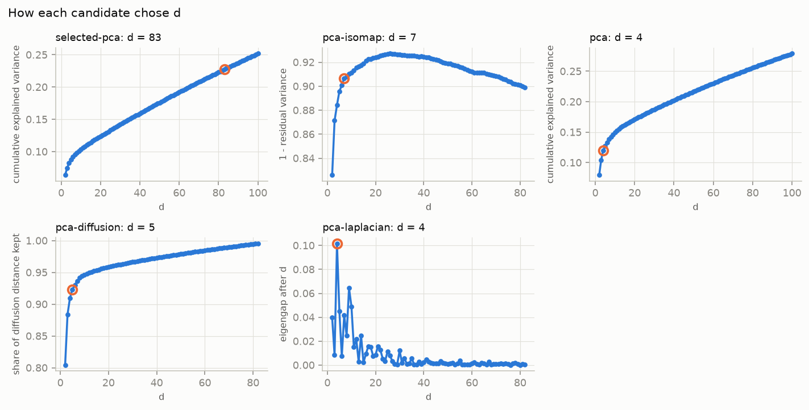

_Each panel is on its own criterion's scale, so the panels are not compared with one another. The ringed point is the chosen d; the rest of the curve is what choosing it gave up or saved._

**metrics**

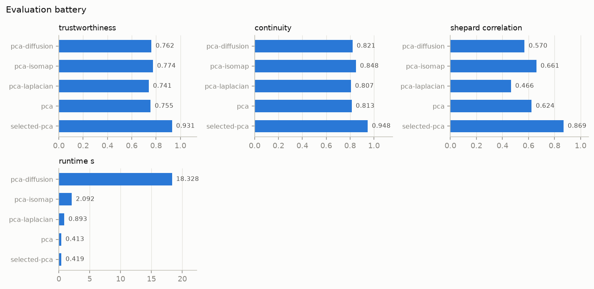

**scree**

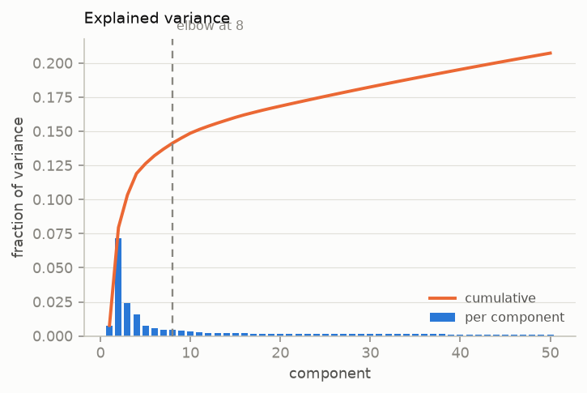

**recon_thumbnail**

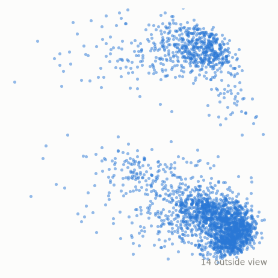

_a projection of the probe coordinates, not a fitted embedding; read it for the shape of the data, not as a result_

_Identity is carried by none in this figure._
<!-- /drtools:figures -->

Each picture is read by its method's `reading`. None of them is a map of cell types, because no labels were supplied.

- The recon thumbnail and plot A of `pca` both show two well-separated masses of unequal size. For PCA, a gap is real separation along the directions shown.
- In plot B of `selected-pca`, UMAP of the winning representation draws three separate groups. Under UMAP's reading, the widths of the gaps between them do not measure how different the groups are, and the groups' sizes do not measure their spread.
- Plot A of `pca-laplacian` shows the pattern typical of Laplacian eigenmaps: long thin arms meeting at a dense core. Under its reading, weakly joined groups are pushed out along separate eigenvectors, and neither the arms' lengths nor the distances between points in different arms mean anything.
- Plot A of `pca-isomap` places a dense main mass apart from smaller groups. Its distances approximate geodesic distances along the graph, and the graph was connected.

None of the panels is collapsed or empty.

## 6. Quantitative comparison

<!-- drtools:metrics sha256=d3eafd21a5cae925 -->
| Candidate | `continuity` | `knn_label_preservation` | `runtime_s` | `shepard_correlation` | `silhouette` | `trustworthiness` |
|---|---|---|---|---|---|---|
| pca | 0.8131 | — | 0.4135 | 0.6245 | — | 0.7552 |
| selected-pca | 0.9484 | — | 0.4189 | 0.8694 | — | 0.9310 |
| pca-laplacian | 0.8069 | — | 0.8927 | 0.4661 | — | 0.7407 |
| pca-isomap | 0.8484 | — | 2.0917 | 0.6609 | — | 0.7742 |
| pca-diffusion | 0.8209 | — | 18.3283 | 0.5697 | — | 0.7621 |

Measured at k=15, capped at 2000 samples, seed 0.

Coverage and run time. Every candidate covers every row; tuning is the search, and the last column is the fit and projection that produced the Embedding.

| Candidate | Rows fitted | Rows projected | New rows placed by | Tuning (s) | Fit and projection (s) |
|---|---|---|---|---|---|
| pca | 2,700 | 0 | — | 2.4 | 0.4 |
| selected-pca | 2,700 | 0 | — | 0.9 | 0.4 |
| pca-laplacian | 2,700 | 0 | — | 5.0 | 0.9 |
| pca-isomap | 2,700 | 0 | — | 13.1 | 2.1 |
| pca-diffusion | 2,700 | 0 | — | 26.5 | 18.3 |
<!-- /drtools:metrics -->

`selected-pca` leads on all three metrics. Every other Candidate works at a small d, and for each of them continuity is above trustworthiness. The evaluation notes read that pattern as follows: true neighbours are kept together, but some points that were far apart are also drawn in, so an apparent cluster in those Embeddings may merge groups that are distinct in the Reference. Among the small-d Candidates, `pca-laplacian` has by far the lowest Shepard correlation. That is what its reading predicts: Laplacian eigenmaps keep neighbourhoods and discard global distances. `pca-diffusion` took the most run time of any Candidate by a wide margin. Run time is reported and carries no weight in the ranking.

## 7. Ranking, with the weighting justification

<!-- drtools:ranking sha256=f61ff011271c01c4 -->
| Rank | Candidate | d | Score | SE | Paired SE | Within the margin | `trustworthiness` | `continuity` | `shepard_correlation` |
|---|---|---|---|---|---|---|---|---|---|
| 1 | selected-pca | 83 | 0.9046 | 0.0035 | — | winner | 0.2328 | 0.2371 | 0.4347 |
| 2 | pca-isomap | 7 | 0.7361 | 0.0040 | 0.0039 |  | 0.1935 | 0.2121 | 0.3305 |
| 3 | pca | 4 | 0.7043 | 0.0057 | 0.0052 |  | 0.1888 | 0.2033 | 0.3122 |
| 4 | pca-diffusion | 5 | 0.6806 | 0.0054 | 0.0052 |  | 0.1905 | 0.2052 | 0.2849 |
| 5 | pca-laplacian | 4 | 0.6200 | 0.0080 | 0.0074 |  | 0.1852 | 0.2017 | 0.2331 |

Winner: **selected-pca** (d = 83).

Weighting declared before any Embedding existed: `trustworthiness` 0.25, `continuity` 0.25, `shepard_correlation` 0.5.
Justification as registered: Default weighting for the balanced focus the checkpoint recorded under --auto. The deliverable is a representation for downstream analysis of unspecified kind, so neither neighbourhood fidelity nor global distance fidelity is favoured beyond the default. There are no labels, so no label-based metric carries weight.

- Standard errors come from a grouped jackknife over the scored rows, in ten groups that are the same for every candidate, so each difference from the winner has its own paired standard error. They hold each fitted Embedding fixed and measure only which rows were scored, so they exclude seed and refit variability and are lower bounds. They are reported and do not enter the choice.

Path of winners: the candidate that wins when each dimension costs a given amount of score, from nothing upwards.

| Candidate | d | Score | Wins from a price of | to |
|---|---|---|---|---|
| selected-pca | 83 | 0.9046 | 0.0000 | 0.0022 |
| pca-isomap | 7 | 0.7361 | 0.0022 | 0.0106 |
| pca | 4 | 0.7043 | 0.0106 | no limit |

- With no value placed on a dimension, selected-pca (d = 83) scores highest.
- If one dimension were worth more than 0.0022 of score, pca-isomap (d = 7) would win; above 0.011, pca (d = 4) would.
- pca-diffusion and pca-laplacian win at no rate.
- The margin rule chose selected-pca, which wins while one dimension is worth less than 0.0022 of score.
<!-- /drtools:ranking -->

The weighting is the default for a balanced focus. The checkpoint recorded that focus under `--auto`, because the recon evidence favoured neither neighbourhoods nor global distances. It was frozen at registration, before any Embedding existed. No other Candidate is within the Margin of the Leader, so the Winner is also the Leader, and there are no Close competitors. The paired standard errors are small compared with every gap to the Winner. They are lower bounds, though, because they hold each Embedding fixed.

## 8. Interpretation

**What won, and what that amounts to.** `selected-pca` wins: a centred PCA on the 2,000 most variable genes, z-scored, and kept at a large d. That is close to what the representation it came from already is. Fidelity rises with d, and the PCA criterion found no elbow on these genes, so the Winner holds many components. Its lead mostly reflects keeping more dimensions. It is not evidence that a linear method describes this data better than a nonlinear one. The path of winners states the trade-off directly. With no price on a dimension, `selected-pca` wins. If one dimension were worth more than a very small amount of score (the threshold is in section 7), `pca-isomap` would win at its much smaller d. At a higher price, `pca` would win. `pca-diffusion` and `pca-laplacian` win at no price.

**What can be attributed to a method.** Nothing in this Run separates a method from its dimension, because no two Candidates with the same preprocessing share a d. `pca-laplacian`, `pca-isomap` and `pca-diffusion` each differ from `selected-pca` in method and in d at the same time. So their gaps to it are not deficits of the spectral or geodesic methods. `pca` and `pca-laplacian` share a d, but they differ in preprocessing: selection and z-scoring, and centred against uncentred decomposition. So their difference is not a method comparison either. Among the small-d Candidates, `pca-isomap` scores highest. That fits the Plan's argument that geodesic distance might suit variance spread across many directions. It cannot confirm the argument, because Isomap's d also differs from the others'.

**What the selection contributed.** `selected-pca` scores far above `pca`, but three things change between them at once: selection with z-scoring, centring, and a much larger d. The Run cannot divide the gap among the three.

**What the data look like.** Every picture shows a few separated groups: two masses in the linear views, and three groups in UMAP of the winning representation. This agrees with the connected but structured neighbourhood graph. Without labels, the Run cannot say what the groups are, and nothing here identifies them as cell types.

**For downstream use.** The exported representation is a faithful, linear, high-dimensional summary. It extends exactly to new cells, and its loadings name genes. If the downstream analysis needs a compact input, such as a small number of coordinates for clustering, the path of winners says what that costs. `pca-isomap` is the smallest Candidate that wins at any price, and it is the one to consider. That choice would be a judgment the ranking did not make.

## 9. Limitations

<!-- drtools:limitations sha256=fb1493869a4f1d02 -->
- Standard errors come from a grouped jackknife over the scored rows, in ten groups that are the same for every candidate, so each difference from the winner has its own paired standard error. They hold each fitted Embedding fixed and measure only which rows were scored, so they exclude seed and refit variability and are lower bounds. They are reported and do not enter the choice.
- Every candidate was scored on the same 2000 of 2700 rows, drawn once under the run's seed.
- This report is reproducible conditional on its registered plan: replaying `plan.registered.json` on the same data under seed 0 returns every number in it. The plan itself is not reproducible. Its candidates were nominated by the agent's judgment, which no seed governs, so running the analysis again may register a different portfolio and choose a different winner.
<!-- /drtools:limitations -->

- **Subsampled scoring.** The metrics describe a fixed subsample of the cells, not all of them. Every Candidate was fitted on every row.
- **No labels.** The two label-based metrics were unavailable for every Candidate, so no weight was dropped: the registered weighting never included them. Nothing in the Run says whether the groups are biologically meaningful.
- **No Close competitors.** The Margin separated the Winner from every other Candidate, and the ranking discriminated among them.
- **The Winner's d is the PCA fallback, capped by the tuning grid.** The same cap sets the input dimension of every nonlinear Candidate.
- **The Linear baseline is an uncentred SVD** of the sparse Reference, not strictly PCA. Its leading component partly tracks cell magnitude.
- **Isomap's neighbourhood size was chosen at the edge of its grid**, so a larger value might have scored higher.
- **A weighting I would now choose differently.** The balanced default, with the default Margin, puts almost no price on dimension. That is why a near-full-rank PCA can win. If the intended downstream use had been known to need a compact representation, I would have argued for a wider Margin before registration, so that a small-d Candidate within reach of the Leader would be preferred. The weighting and Margin are frozen, so this is recorded here and not applied. A changed weighting would need a new Run.
- **Stochastic methods ran under one seed.** Refit variability is not measured.

## 10. Exported results

<!-- drtools:export sha256=d58ff62eae118693 -->
Exported: **selected-pca**, the winner of the ranking, at d = 83.

- `data/selected-pca.csv`: one row per sample -- `sample_id`, whether the method was `fitted` on the row or `projected` it (2,700 and 0), then `dim_1` to `dim_83`.
- `data/manifest.json`: the pipeline and its parameter values, the seed (0), d, the features kept, the z-score means and standard deviations, and the rows fitted and projected.
- `data/selected-pca.loadings.csv`: the loadings, one row per input the method acted on, by name: a feature, or a component of the reduction before it.
- New samples: the method can place them without refitting (`transform`).
- No model objects are saved: a saved model often fails to load under another library version. The manifest carries what a refit needs.
<!-- /drtools:export -->

The export is the Winner's representation, one row per cell. The manifest holds everything a refit needs: the pipeline, the parameter values, the genes kept, and the z-score means and standard deviations. The loadings file lists each component's weight on each selected gene, which is what lets a reader interpret the components.
