# Dimension reduction report — graded-pathmnist

## 1. Dataset profile

<!-- drtools:profile sha256=da5a082ae4cbe669 -->
| Property | Value |
|---|---|
| Dataset | pathmnist_train (`pathmnist`, medmnist.PathMNIST(split='train')) |
| Modality | histology images |
| Samples | 89996 |
| Features | 2352 |
| Storage | dense, float32, 846.68 MB |
| Sparsity | 0.0001 |
| Values | bounded_unit_interval |
| Identity | `ca08db2d0a77` |
| Labels | 9 classes (ground_truth), balance ratio 1.63 |

- {'observation': '89,996 samples. Methods with quadratic memory in the sample count — MDS, Isomap, dense-kernel spectral methods — are infeasible at this size without subsampling.', 'evidence': ['profile.shape.n_samples']}
- {'observation': 'Sample totals vary 33-fold across the dataset. Without per-sample normalisation, the leading variation in any distance-based embedding will be total magnitude rather than profile shape.', 'evidence': ['profile.samples.total_ratio_max_min']}
<!-- /drtools:profile -->

PathMNIST is a set of small colour histology patches from colorectal tissue. Each patch is flattened to one intensity per pixel and colour channel, so every feature is the same kind of measurement on the same bounded scale. The table above shows that the matrix is dense, has no constant columns and no duplicate rows, and carries ground-truth tissue labels whose classes are roughly balanced.

The profile's second observation says sample totals vary many-fold. For images, that total is the patch's overall brightness. Unlike sequencing depth, brightness is part of what distinguishes tissue types: the background and adipose patches are mostly pale. So the total was treated as signal, and no per-sample normalisation was applied (section 2).

Reconnaissance (probe representation: `drop_constant`, then PCA to a few dozen components, on a label-stratified subsample) found three things.
- The leading principal component alone carries more than half the variance. After it, the spectrum decays slowly: the cumulative share stays below the upper thresholds within the components computed.
- The two-NN intrinsic-dimension estimate is in the twenties.
- The k-nearest-neighbour graph is a single connected component.

These numbers describe the probe representation, not the raw matrix. They are in `recon.json` and were cited in the Plan. The thumbnail showed one large central mass, a denser lobe beside it, and a small, well-separated group.

## 2. Preprocessing decisions, and why

<!-- drtools:preprocessing sha256=a562f2ed7e68199c -->
Data decision: values `not_counts`, features `one_type`, decided by agent, citing `profile.values.suspected_kind`, `profile.values.is_integer_valued`, `profile.features.column_kinds`, `profile.features.source_format`, `profile.features.std_ratio_p95_p05`.

The base follows the rule for that decision.

Base preprocessing, applied to every Candidate and to the reference:

1. `drop_constant`

By rule, the 2,000 most variable features are kept and z-scored before the method in `pca-laplacian`, `pca-diffusion`, `pca-kernel-pca`: with more than 2,000 features of one type, a method working through Euclidean distances selects by variance. The Linear baseline never selects; the Selected baseline, `selected-pca`, is the same PCA behind the same selection. With the preprocessing held fixed, a selecting Candidate's difference from the Selected baseline is its method's, and the Selected baseline's difference from the Linear baseline is the selection and z-score's -- but only where the two share a d. At different d, each difference is also the dimension's.
<!-- /drtools:preprocessing -->

The values are not counts. They are non-integer and lie in the unit interval, which is what pixel intensities look like. The features are of one type: every column is continuous, and all come from the same image grid. The evidence settled both facts, so they were my decision (`decided_by: agent`), not defaults. Two consequences follow.
- There is no `normalise_total` or `log1p` step. Both exist to remove sequencing depth and to stabilise count variance, and neither problem is present here.
- There is no global `standardise` in the base. All the features share one native scale, so z-scoring them would mainly amplify the low-variance border pixels.

The Reference every Candidate is scored against is therefore the raw pixel matrix, minus no columns (none were constant).

The feature-selection rule then applies inside the three nonlinear Candidates, which select the most variable pixels and z-score them before their PCA pre-step. The two baselines separate the effect of that selection from the effect of each method:
- `pca` against `selected-pca` measures what selection plus z-scoring does to a linear reduction, at the same d.
- Each nonlinear Candidate against `selected-pca` would measure the method alone, but only at equal d. As section 8 explains, the Run never compared them at equal d.

## 3. Methods selected and rejected

<!-- drtools:methods sha256=620fe427edff3a0e -->
**Selected**

| Candidate | Pipeline | Why |
|---|---|---|
| pca | `pca` | Linear baseline on the native pixel scale. PC1 alone carries 55% of the probe variance and the spectrum bends near 15 components, so a linear subspace captures a large share of the structure; every nonlinear Candidate has to beat this to be worth its cost. |
| selected-pca | `select_variable_features` -> `standardise` -> `pca` | Selected baseline required by the feature-selection rule: separates the effect of selecting and standardising 2000 features from the effect of the nonlinear methods that follow it. |
| pca-laplacian | `select_variable_features` -> `standardise` -> `pca` -> `subsample` -> `laplacian_eigenmaps` | Local-structure Candidate. The k=15 neighbourhood graph is a single connected component, so the graph Laplacian's eigenvectors are coordinates rather than component indicators. Variance is not confined to a small linear subspace (80% is not reached within 50 components), which is where a graph method can add to PCA. The PCA pre-step to the spectral elbow removes the long tail of low-variance pixel noise before the graph is built. n = 89,996 exceeds its scales_to of 50,000, so it is fitted on a stratified 20,000 and the rest are placed by Nystrom extension. |
| pca-diffusion | `select_variable_features` -> `standardise` -> `pca` -> `subsample` -> `diffusion_maps` | Global-structure Candidate. Diffusion distance averages over all paths, so it is robust to the pixel noise that spreads variance over many components, and the connected graph means diffusion reaches the whole data. The intrinsic dimension of about 24 argues for a method whose d is chosen by its own criterion rather than fixed low. n exceeds its scales_to of 10,000, so it is fitted on a stratified 8,000 and the rest are placed by Nystrom extension. |
| pca-kernel-pca | `select_variable_features` -> `standardise` -> `pca` -> `subsample` -> `kernel_pca` | A nonlinear extension of the Linear baseline that stays closest to it: RBF kernel PCA with a tuned width. Because variance is spread beyond any small linear subspace, a kernel map may capture curvature PCA smears; comparing it directly with PCA tells how much nonlinearity is present. n exceeds its scales_to of 10,000, so it is fitted on a stratified 8,000 and the rest are projected. |

**Rejected**

| Method | Why not | Evidence |
|---|---|---|
| mds | O(n^2) memory at n = 89,996, and it cannot place rows it was not fitted on (new_rows none), so it cannot be subsampled. PCA already captures the Euclidean variance structure metric MDS would recover. | `profile.shape.n_samples` |
| isomap | Scales only to 5,000 rows, so it would be fitted on about 5.5% of the data. With an intrinsic dimension near 24 the geodesic graph on so thin a sample is prone to short-circuit edges that corrupt the whole embedding; Diffusion Maps covers the global, connectivity-based view with more fitted rows and averages over paths instead of relying on shortest ones. | `profile.shape.n_samples`, `recon.intrinsic_dimension.twonn`, `recon.subsample.n_used` |
| lle | The local-structure family is already represented by Laplacian Eigenmaps on a connected graph. LLE assumes the manifold is locally linear at a small neighbourhood size; with an intrinsic dimension near 24, neighbourhoods of the size LLE needs to be stable at useful d span too much of the data, and its standard variant collapses regions when the weight problem is ill-conditioned. | `recon.intrinsic_dimension.twonn`, `recon.neighbourhood.n_connected_components` |
| sparse_pca | Assumes the signal is carried by a small subset of features. In these images the leading component (55% of variance) is a dense, image-wide intensity axis, and pixel intensities have nearly uniform spread across all 2,352 columns, so there is no small informative subset for an L1 penalty to find. | `recon.spectrum.probe.explained_variance_ratio`, `profile.features.std_ratio_p95_p05` |
<!-- /drtools:methods -->

This is a Representation run, so only Reductions were eligible. t-SNE, UMAP, PHATE, PaCMAP and TriMap are Visualization methods and are excluded by rule, not by judgement. UMAP appears only in the unscored Plot B figures.

The portfolio covers each family once:
- `pca`, the Linear baseline;
- `selected-pca`, the Selected baseline the rule requires;
- `pca-laplacian`, a local, graph-based spectral method;
- `pca-diffusion`, a global, connectivity-based spectral method;
- `pca-kernel-pca`, a kernel extension of PCA. It is the most direct test of whether a nonlinear map adds anything to the linear one.

Every nonlinear Candidate puts a PCA pre-step in front of its method. The spectrum's long tail holds many components of small, noise-like variance, and building a neighbourhood graph or kernel on the full pixel space would let that tail blur the distances.

The rejections were decided by two facts together: the sample size, and the high intrinsic dimension of the data.
- **MDS** cannot place rows it was not fitted on, so it cannot be subsampled, and at this n its distance matrix is infeasible.
- **Isomap** could only be fitted on a very thin subsample. Its shortest-path geodesics are the most fragile quantity in the portfolio: one spurious edge between distant regions corrupts every distance that passes through it. That risk is high in a space whose intrinsic dimension is in the twenties. Diffusion Maps asks the same connectivity question more robustly, because it averages over all paths rather than trusting the shortest one.
- **LLE** duplicates the local family already covered by Laplacian Eigenmaps. Its locally-linear assumption becomes fragile when neighbourhoods have to span a high-dimensional patch.
- **Sparse PCA** looks for signal in a few features. Here the dominant axis is dense and image-wide, and the pixel spreads are nearly uniform, so there is no small informative subset for it to find.

## 4. Hyperparameter choices, and why

<!-- drtools:hyperparameters sha256=1072be8c58af71db -->
**pca**

| Stage | Parameter | Value | Source |
|---|---|---|---|
| `pca` | `n_components` | 38 | tuned |
| `pca` | `whiten` | False | registry_default |

Tuned: d = 38, chosen by the fallback rule on its curve of cumulative explained variance.

**selected-pca**

| Stage | Parameter | Value | Source |
|---|---|---|---|
| `select_variable_features` | `n_features` | 2000 | specified |
| `pca` | `n_components` | 38 | tuned |
| `pca` | `whiten` | False | registry_default |

Tuned: d = 38, chosen by the fallback rule on its curve of cumulative explained variance.

**pca-laplacian**

| Stage | Parameter | Value | Source |
|---|---|---|---|
| `select_variable_features` | `n_features` | 2000 | specified |
| `pca` | `n_components` | 38 | tuned |
| `pca` | `whiten` | False | registry_default |
| `subsample` | `n_samples` | 20000 | specified |
| `laplacian_eigenmaps` | `n_components` | 6 | tuned |
| `laplacian_eigenmaps` | `n_neighbors` | 30 | tuned |

Tuned: d = 6, chosen by the eigengap rule on its curve of eigengap after d; `n_neighbors` = 30, 2 times the suggestion of 15 at 1,996 rows, at the edge of the multiplier grid, so a value beyond it might score higher.

**pca-diffusion**

| Stage | Parameter | Value | Source |
|---|---|---|---|
| `select_variable_features` | `n_features` | 2000 | specified |
| `pca` | `n_components` | 38 | tuned |
| `pca` | `whiten` | False | registry_default |
| `subsample` | `n_samples` | 8000 | specified |
| `diffusion_maps` | `n_components` | 2 | tuned |
| `diffusion_maps` | `epsilon` | None | tuned |
| `diffusion_maps` | `alpha` | 1.0 | suggested |
| `diffusion_maps` | `t` | 1 | tuned |
| `diffusion_maps` | `width_multiplier` | 2.0 | tuned |

Tuned: d = 2, chosen by the flat rule on its curve of share of diffusion distance kept; `epsilon` at 2 times the width the executor's rule computes, at the edge of the multiplier grid, so a value beyond it might score higher.

**pca-kernel-pca**

| Stage | Parameter | Value | Source |
|---|---|---|---|
| `select_variable_features` | `n_features` | 2000 | specified |
| `pca` | `n_components` | 38 | tuned |
| `pca` | `whiten` | False | registry_default |
| `subsample` | `n_samples` | 8000 | specified |
| `kernel_pca` | `n_components` | 3 | tuned |
| `kernel_pca` | `kernel` | rbf | specified |
| `kernel_pca` | `gamma` | None | tuned |
| `kernel_pca` | `width_multiplier` | 0.5 | tuned |

Tuned: d = 3, chosen by the elbow rule on its curve of cumulative kernel variance; `gamma` at 0.5 times the width the executor's rule computes, at the edge of the multiplier grid, so a value beyond it might score higher.
<!-- /drtools:hyperparameters -->

No value was overridden. Every tuned parameter was centred on the toolbox's Suggestion or rule, and each method chose its own d by its own criterion, on a stratified tuning subsample. The only values I set myself are the subsample sizes. For each method whose `scales_to` is below n, I chose a size inside that limit that leaves room for the tuning grid within the standard Budget. The two methods limited to about ten thousand rows were fitted on fewer rows than Laplacian Eigenmaps.

The d choices matter most for reading the ranking.
- **PCA** found no elbow in the slowly decaying spectrum, so it fell back to its fallback rule and chose a large d.
- **The three nonlinear methods** chose small d. Laplacian Eigenmaps took the largest eigengap, and Kernel PCA the elbow of its kernel-variance curve. Diffusion Maps took the smallest d on the grid, because its diffusion-distance curve is already nearly flat there.

Three tuned widths or neighbourhood sizes landed at the edge of the multiplier grid, as the table notes: Laplacian's `n_neighbors`, Diffusion's width, and Kernel PCA's width. A value beyond the grid might have scored higher.

Diffusion Maps' bandwidth also had to be doubled repeatedly by the connectivity floor, which stops the kernel from isolating individual samples. The narrowest width in its grid was refused outright for that reason. Both are signs that local density varies widely in this data, which the reconnaissance density ratio also indicated.

## 5. Figures

<!-- drtools:figures sha256=68537c7bb7f3e3fb -->
**comparison**

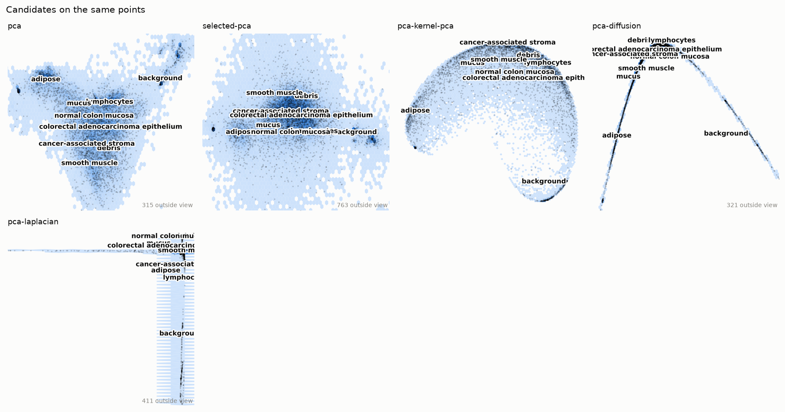

**embedding_pca**

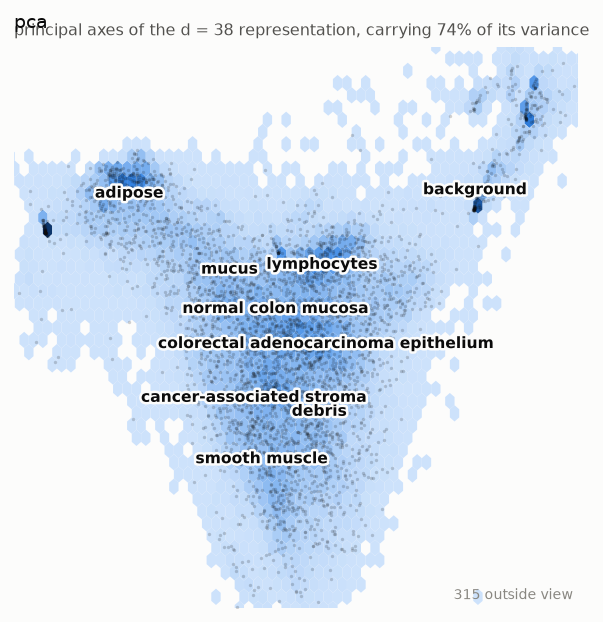

_Plot A: the d = 38 representation on its first two principal axes, which carry 74% of its variance. A rotation, so the distances within those two axes are the representation's own; the variance beyond them is not shown._

**plot_b_pca**

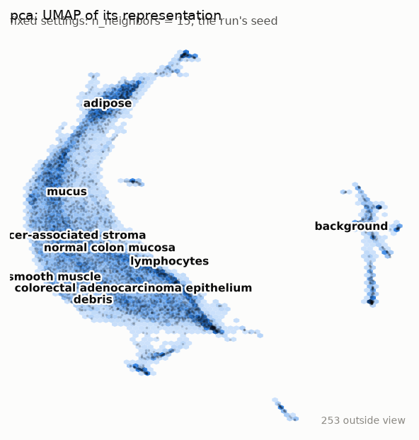

_Plot B: umap of the representation at the same fixed settings for every candidate (n_neighbors = 15, the run's seed). A picture of the representation, not the representation, and not scored._

_How to read a umap picture. Distances: Distances between groups are kept better than by t-SNE but are still not to scale. Within a group, neighbourhood membership is what is kept. Gaps: The width of a gap does not measure dissimilarity; min_dist and the graph's connectivity shape it. Sizes: Local distances are normalised point by point, so density is largely lost and a group's size says little about its spread._

**embedding_selected-pca**

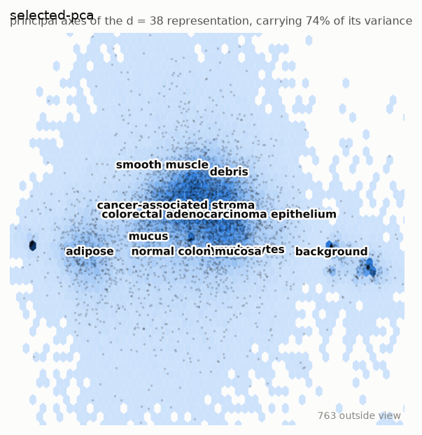

_Plot A: the d = 38 representation on its first two principal axes, which carry 74% of its variance. A rotation, so the distances within those two axes are the representation's own; the variance beyond them is not shown._

**plot_b_selected-pca**

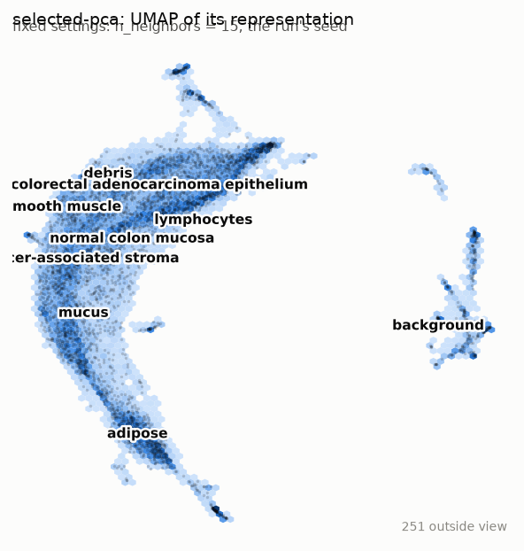

_Plot B: umap of the representation at the same fixed settings for every candidate (n_neighbors = 15, the run's seed). A picture of the representation, not the representation, and not scored._

_How to read a umap picture. Distances: Distances between groups are kept better than by t-SNE but are still not to scale. Within a group, neighbourhood membership is what is kept. Gaps: The width of a gap does not measure dissimilarity; min_dist and the graph's connectivity shape it. Sizes: Local distances are normalised point by point, so density is largely lost and a group's size says little about its spread._

**embedding_pca-kernel-pca**

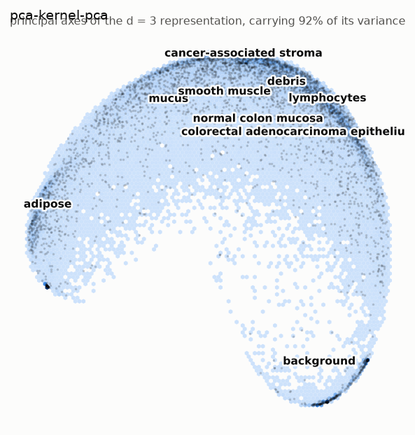

_Plot A: the d = 3 representation on its first two principal axes, which carry 92% of its variance. A rotation, so the distances within those two axes are the representation's own; the variance beyond them is not shown._

**plot_b_pca-kernel-pca**

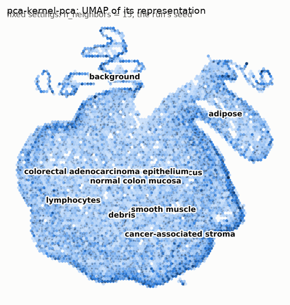

_Plot B: umap of the representation at the same fixed settings for every candidate (n_neighbors = 15, the run's seed). A picture of the representation, not the representation, and not scored._

_How to read a umap picture. Distances: Distances between groups are kept better than by t-SNE but are still not to scale. Within a group, neighbourhood membership is what is kept. Gaps: The width of a gap does not measure dissimilarity; min_dist and the graph's connectivity shape it. Sizes: Local distances are normalised point by point, so density is largely lost and a group's size says little about its spread._

**embedding_pca-diffusion**

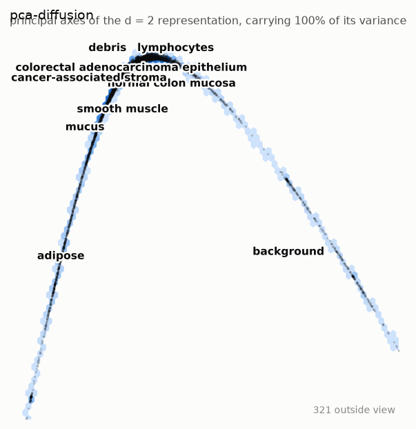

_Plot A: the d = 2 representation on its first two principal axes, which carry 100% of its variance. A rotation, so the distances within those two axes are the representation's own; the variance beyond them is not shown._

**embedding_pca-laplacian**

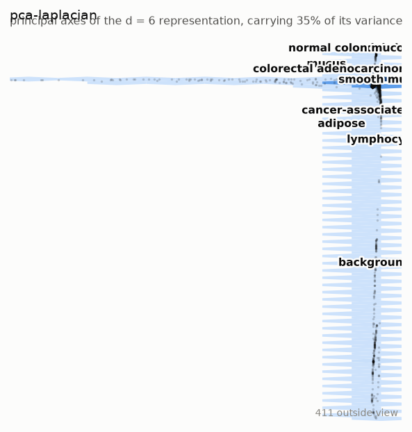

_Plot A: the d = 6 representation on its first two principal axes, which carry 35% of its variance. A rotation, so the distances within those two axes are the representation's own; the variance beyond them is not shown._

**plot_b_pca-laplacian**

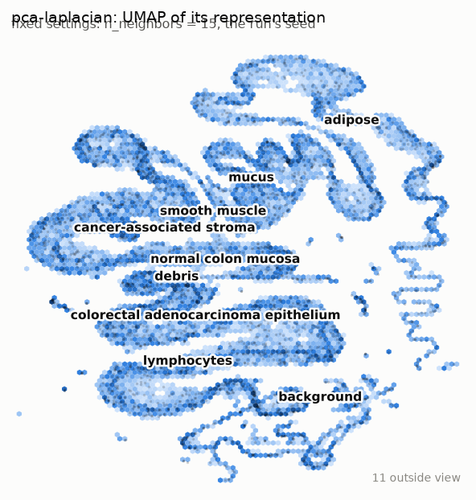

_Plot B: umap of the representation at the same fixed settings for every candidate (n_neighbors = 15, the run's seed). A picture of the representation, not the representation, and not scored._

_How to read a umap picture. Distances: Distances between groups are kept better than by t-SNE but are still not to scale. Within a group, neighbourhood membership is what is kept. Gaps: The width of a gap does not measure dissimilarity; min_dist and the graph's connectivity shape it. Sizes: Local distances are normalised point by point, so density is largely lost and a group's size says little about its spread._

**class_facet**

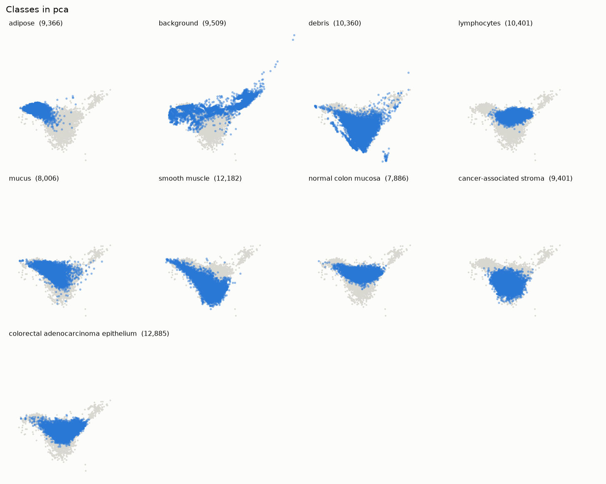

**shepard**

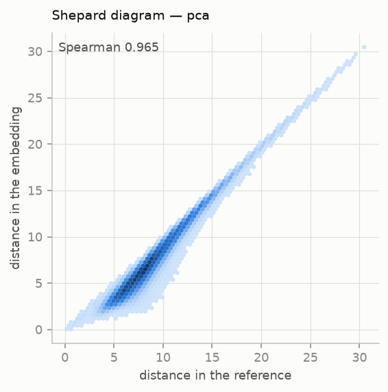

**class_facet_selected-pca**

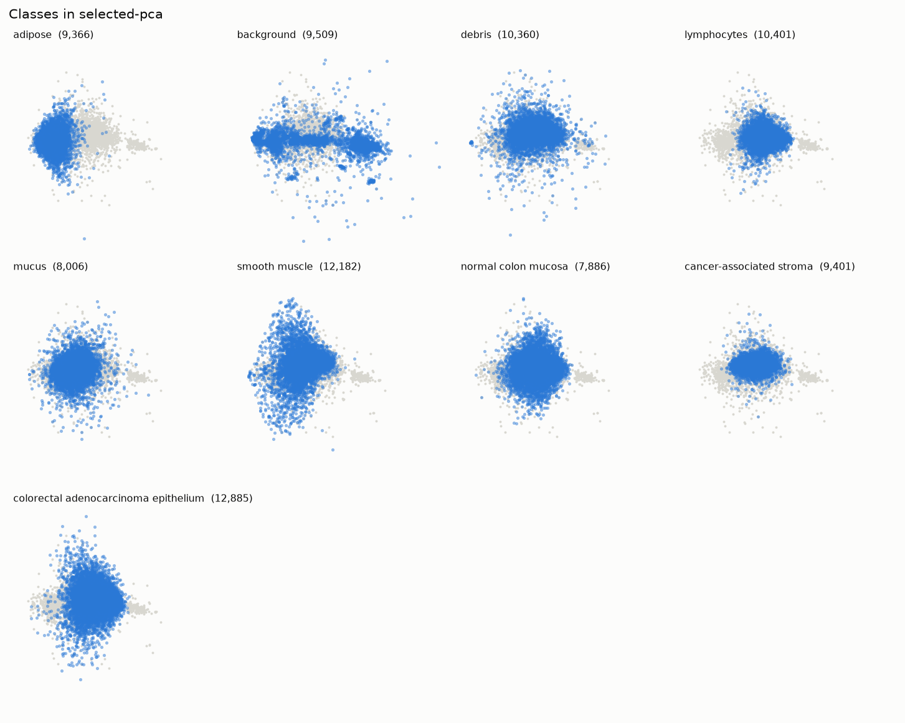

_Drawn for selected-pca because it is a close competitor: the margin could not separate it from the winner, so these are the figures a reader separates them with._

**shepard_selected-pca**

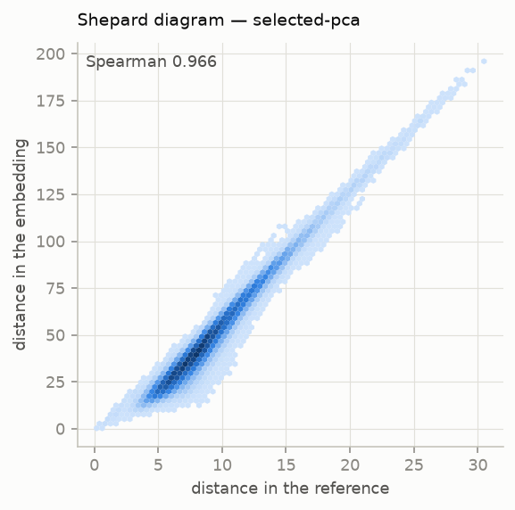

_Drawn for selected-pca because it is a close competitor: the margin could not separate it from the winner, so these are the figures a reader separates them with._

**d_curves**

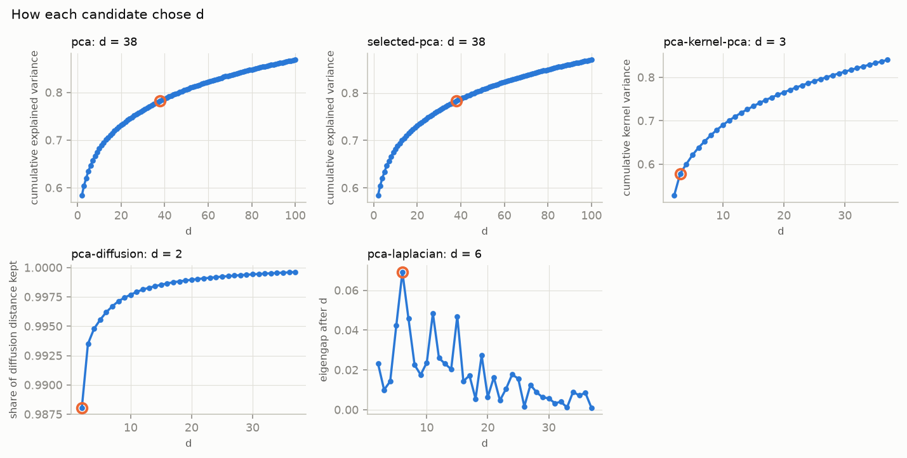

_Each panel is on its own criterion's scale, so the panels are not compared with one another. The ringed point is the chosen d; the rest of the curve is what choosing it gave up or saved._

**metrics**

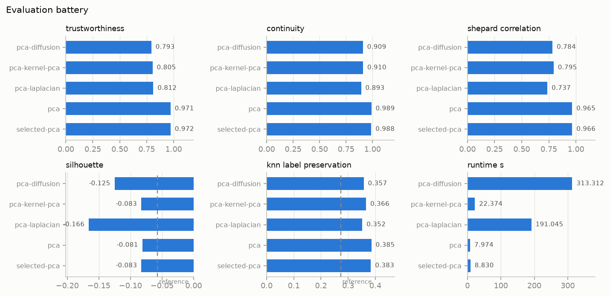

**scree**

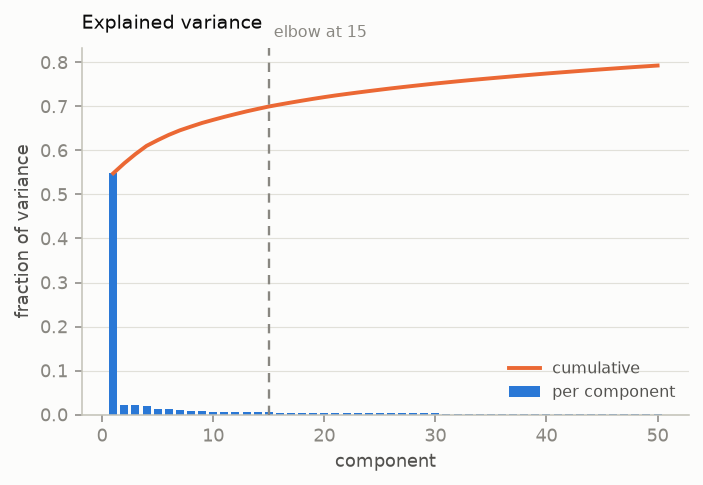

**recon_thumbnail**

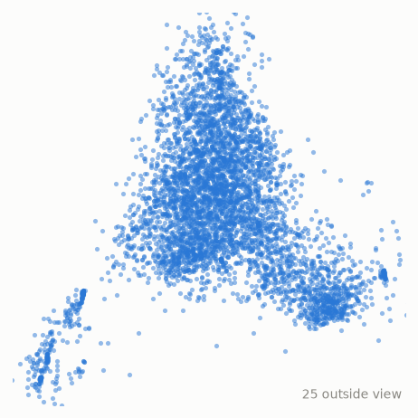

_a projection of the probe coordinates, not a fitted embedding; read it for the shape of the data, not as a result_
<!-- /drtools:figures -->

Read each picture by its method's `reading`.

**PCA and selected-PCA.** The two leading axes of `pca` and `selected-pca` show a projection. A gap in it is real separation along the axes shown, and overlapping classes may still separate in directions not shown. The class facet for `pca` shows the following on those axes:
- adipose and background occupy their own regions at the edges;
- lymphocytes, normal mucosa and cancer-associated stroma occupy distinct but overlapping zones;
- debris and smooth muscle spread along the lower lobe.

**Plot B.** The Plot B UMAP picture of the `pca` representation separates background almost completely and gives adipose its own arm. The other tissue classes form one continuous band, in which neighbourhoods are kept but distances between classes are not to scale.

**Shepard diagram.** The Shepard diagram for `pca` is tight and close to the diagonal. Its spread is largest at small reference distances, which are where a projection compresses most.

**Nonlinear Candidates.** Their pictures show the geometry their readings warn of:
- Diffusion Maps concentrates most points on thin curves, because diffusion at this width contracts dense groups.
- Laplacian Eigenmaps places most points in a tight core and a few far out along single axes. Its coordinates carry no eigenvalue weight, so those long arms are not distances in the data.
- Kernel PCA draws a curved band. Its distances are compressed at the large end by the RBF kernel.

Identity is carried by class names printed on the pictures, not by colour (see section 9).

## 6. Quantitative comparison

<!-- drtools:metrics sha256=3bfb6b2794e65c88 -->
| Candidate | `continuity` | `knn_label_preservation` | `runtime_s` | `shepard_correlation` | `silhouette` | `trustworthiness` |
|---|---|---|---|---|---|---|
| pca | 0.9893 | 0.3854 | 7.9744 | 0.9653 | -0.0811 | 0.9712 |
| selected-pca | 0.9882 | 0.3834 | 8.8297 | 0.9656 | -0.0826 | 0.9717 |
| pca-laplacian | 0.8928 | 0.3519 | 191.0448 | 0.7368 | -0.1658 | 0.8115 |
| pca-diffusion | 0.9091 | 0.3571 | 313.3125 | 0.7841 | -0.1250 | 0.7930 |
| pca-kernel-pca | 0.9105 | 0.3658 | 22.3743 | 0.7945 | -0.0828 | 0.8045 |

Measured at k=15, capped at 2000 samples, seed 0.

Coverage and run time. Every candidate covers every row; tuning is the search, and the last column is the fit and projection that produced the Embedding.

| Candidate | Rows fitted | Rows projected | New rows placed by | Tuning (s) | Fit and projection (s) |
|---|---|---|---|---|---|
| pca | 89,996 | 0 | — | 0.8 | 8.0 |
| selected-pca | 89,996 | 0 | — | 0.8 | 8.8 |
| pca-laplacian | 19,997 | 69,999 | nystrom | 3.7 | 191.0 |
| pca-diffusion | 7,995 | 82,001 | nystrom | 28.9 | 313.3 |
| pca-kernel-pca | 7,995 | 82,001 | transform | 4.5 | 22.4 |
<!-- /drtools:metrics -->

**The two baselines.** They are nearly indistinguishable on every metric. Both keep neighbourhoods (trustworthiness and continuity) and global distances (Shepard correlation) very closely.

**The three nonlinear Candidates.** They sit at a clearly lower level on all three structural metrics. Their continuity exceeds their trustworthiness: they keep true neighbours together, but they also bring in points that were far apart, so groups that look like clusters may merge distinct tissue types.

**Silhouette.** It is negative for every Candidate and for the Reference itself. In the pixel space the tissue classes are not compact, well-separated clouds.

**kNN label preservation.** It is above the Reference value for every Candidate. This does not mean more than all of the label structure was kept. The Reference is a noisy baseline: in the full pixel space distances concentrate, and discarding low-variance directions makes neighbours agree on their labels more often.

**Runtime.** It is reported, not scored. The PCA baselines fit in seconds. The two spectral methods took minutes, mostly in the fit on their subsample.

## 7. Ranking, with the weighting justification

<!-- drtools:ranking sha256=1a2afd81e792e9d1 -->
| Rank | Candidate | d | Score | SE | Paired SE | Within the margin | `trustworthiness` | `continuity` | `shepard_correlation` | `knn_label_preservation` | `silhouette` |
|---|---|---|---|---|---|---|---|---|---|---|---|
| 1 | pca | 38 | 0.8040 | 0.0021 | — | winner | 0.1700 | 0.1731 | 0.3379 | 0.0771 | 0.0459 |
| 2 | selected-pca | 38 | 0.8035 | 0.0022 | 0.0006 | close, -0.0005 | 0.1701 | 0.1729 | 0.3380 | 0.0767 | 0.0459 |
| 3 | pca-kernel-pca | 3 | 0.6972 | 0.0030 | 0.0023 |  | 0.1408 | 0.1593 | 0.2781 | 0.0732 | 0.0459 |
| 4 | pca-diffusion | 2 | 0.6875 | 0.0030 | 0.0028 |  | 0.1388 | 0.1591 | 0.2744 | 0.0714 | 0.0437 |
| 5 | pca-laplacian | 6 | 0.6682 | 0.0038 | 0.0041 |  | 0.1420 | 0.1562 | 0.2579 | 0.0704 | 0.0417 |

Winner: **pca** (d = 38).

Close competitors, within 0.02 of the leader pca: selected-pca (d = 38, -0.0005).
Weighting declared before any Embedding existed: `trustworthiness` 0.175, `continuity` 0.175, `shepard_correlation` 0.35, `knn_label_preservation` 0.2, `silhouette` 0.1.
Justification as registered: The checkpoint recorded a representation for downstream analysis with a balanced focus, taken by default under --auto. The balanced default puts half of the structural weight on the Shepard correlation (global distances) and splits the rest between trustworthiness and continuity (neighbourhoods). The labels are the nine tissue classes supplied with PathMNIST as ground truth, not derived from these data, so they are trusted and take the labelled default's 0.20 for kNN label preservation and 0.10 for silhouette.

- pca leads, and no candidate within 0.02 of it has fewer dimensions (d = 38). Its close competitors, each with its score minus the winner's: selected-pca (d = 38, -0.0005, SE 0.0006). Each lies within the margin, so the ranking does not separate it from pca.
- Standard errors come from a grouped jackknife over the scored rows, in ten groups that are the same for every candidate, so each difference from the winner has its own paired standard error. They hold each fitted Embedding fixed and measure only which rows were scored, so they exclude seed and refit variability and are lower bounds. They are reported and do not enter the choice.

Path of winners: the candidate that wins when each dimension costs a given amount of score, from nothing upwards.

| Candidate | d | Score | Wins from a price of | to |
|---|---|---|---|---|
| pca | 38 | 0.8040 | 0.0000 | 0.0031 |
| pca-kernel-pca | 3 | 0.6972 | 0.0031 | 0.0097 |
| pca-diffusion | 2 | 0.6875 | 0.0097 | no limit |

- With no value placed on a dimension, pca (d = 38) scores highest.
- If one dimension were worth more than 0.0031 of score, pca-kernel-pca (d = 3) would win; above 0.0097, pca-diffusion (d = 2) would.
- selected-pca and pca-laplacian win at no rate.
- The margin rule chose pca, which wins while one dimension is worth less than 0.0031 of score.
<!-- /drtools:ranking -->

The weighting is the default for a balanced focus with trusted labels. It was registered before any Embedding existed and was not changed. The labels are PathMNIST's own tissue annotations, supplied with the data rather than derived from it, which is why they carry weight.

`pca` leads, and `selected-pca` is its only Close competitor. Both have the same d, so the margin rule's tie-break on fewer dimensions does not apply, and `pca` is the Winner as the Leader.

The path of winners states the trade-off with the low-dimensional Candidates. A smaller representation wins only if each dimension is assumed to cost more than a small amount of score. At that price Kernel PCA wins. At a higher price Diffusion Maps wins, at the smallest d of all. Laplacian Eigenmaps and the Selected baseline win at no price.

## 8. Interpretation

**What won.** A linear reduction of the raw pixels, `pca`, is the recommended representation for downstream analysis. It keeps a few dozen components, which retain most, but not all, of the pixel variance. It keeps both neighbourhoods and pairwise distances of the pixel space very faithfully. It is also the cheapest Candidate to fit, and it places new patches exactly through its loadings.

**`pca` against `selected-pca`, the Close competitor.** These two share a d, so this is the one comparison in the Run that isolates a single factor: selecting the most variable pixels and z-scoring them. The difference is inside the Margin and small against its paired standard error. The class facets and Shepard diagrams of the two are visually alike. Nothing in the Run separates them. For these images, dropping the least variable pixels and rescaling the rest changes the linear representation negligibly. That is expected when every pixel is measured on one scale and the pixel spreads are nearly uniform. `pca` is the Winner as the Leader, and it has the simpler pipeline.

**The nonlinear Candidates.** Each scored well below the baselines, but each also chose a far smaller d. The Run never compared a nonlinear method with PCA at the same d. The gap therefore mixes two effects: the method, and the dimensions it gave up. It is not evidence that the spectral or kernel maps "add nothing". What the Run does show is this:
- at the dimensions their own criteria picked, none of them keeps the pixel-space geometry as well as a many-component linear projection;
- the path of winners gives the price per dimension at which Kernel PCA, and then Diffusion Maps, would be preferred.

A reader who needs a compact, low-dimensional representation should read that path rather than the rank order. Among the compact Candidates, Kernel PCA gives the best trade-off.

**What the geometry suggests about the data.** Several findings point the same way:
- the spectrum decays slowly after one dominant axis;
- the intrinsic-dimension estimate is in the twenties;
- silhouette is negative everywhere;
- in the Plot B picture most tissue classes form one continuous band, with only background, and to a lesser degree adipose, clearly apart.

Together they say that, in raw pixel space, PathMNIST is not a set of well-separated low-dimensional clusters. The leading axis most plausibly tracks overall patch brightness and colour: it separates the pale background and adipose patches. This reading comes from the class facet, not from a measured loading analysis. Tissue identity beyond that is spread over many weak directions. This is consistent with the dataset's known use: tissue classes in PathMNIST are separated by texture features that a convolutional network learns, not by pixel-wise Euclidean geometry.

## 9. Limitations

<!-- drtools:limitations sha256=01757bed0b9234a8 -->
- pca leads, and no candidate within 0.02 of it has fewer dimensions (d = 38). Its close competitors, each with its score minus the winner's: selected-pca (d = 38, -0.0005, SE 0.0006). Each lies within the margin, so the ranking does not separate it from pca.
- Standard errors come from a grouped jackknife over the scored rows, in ten groups that are the same for every candidate, so each difference from the winner has its own paired standard error. They hold each fitted Embedding fixed and measure only which rows were scored, so they exclude seed and refit variability and are lower bounds. They are reported and do not enter the choice.
- Every candidate was scored on the same 1996 of 89996 rows, drawn once under the run's seed.
- This report is reproducible conditional on its registered plan: replaying `plan.registered.json` on the same data under seed 0 returns every number in it. The plan itself is not reproducible. Its candidates were nominated by the agent's judgment, which no seed governs, so running the analysis again may register a different portfolio and choose a different winner.
<!-- /drtools:limitations -->

- **No metric was dropped.** The full registered weighting was applied.
- **Close competitor.** `selected-pca` is within the Margin of `pca`. Section 8 explains why nothing distinguishes them.
- **Subsampling, three kinds.**
  - Every metric was computed on the same stratified subsample of a couple of thousand rows, because the metrics are quadratic in n. They describe neighbourhoods at that sampling density, which is sparser than in the full data.
  - The three nonlinear methods were fitted on subsamples and placed the remaining rows by Nyström extension or transform. A weak placement of those rows counts against them in the ranking.
  - Reconnaissance was also run on a subsample.
- **Grid edges.** Three tuned widths or neighbourhood sizes ended at the edge of their grids (section 4), so the nonlinear Candidates may be somewhat under-tuned.
- **Unequal d.** The nonlinear methods chose their own small d. No nonlinear method was compared with PCA at matched d, so their deficit cannot be attributed to the method alone.
- **Labels in figures.** They are printed as class names rather than colours. With this many classes, no categorical palette clears the separation floors for scatter plots under simulated colour-vision deficiency.
- **Weighting.** With hindsight, I would keep the balanced weighting. Silhouette is negative for every Candidate and for the Reference, and its weight therefore mostly adds a near-constant offset. A Run meant to find groups rather than to preserve geometry might reasonably have weighted it lower.
- **Automatic run.** Under `--auto` the Purpose and focus are defaults, not the user's answers.

## 10. Exported results

<!-- drtools:export sha256=771423085fad0e3b -->
Exported: **pca**, the winner of the ranking, at d = 38.

- `data/pca.csv`: one row per sample -- `sample_id`, whether the method was `fitted` on the row or `projected` it (89,996 and 0), then `dim_1` to `dim_38`.
- `data/manifest.json`: the pipeline and its parameter values, the seed (0), d, the features kept, the z-score means and standard deviations, and the rows fitted and projected.
- `data/pca.loadings.csv`: the loadings, one row per input the method acted on, by name: a feature, or a component of the reduction before it.
- New samples: the method can place them without refitting (`transform`).
- No model objects are saved: a saved model often fails to load under another library version. The manifest carries what a refit needs.
<!-- /drtools:export -->

The exported representation is the Winner's component scores for every sample. The manifest carries everything a refit needs, and the loadings project new patches without refitting. Downstream clustering or regression on these scores inherits PCA's reading: Euclidean distance between rows is pixel-space distance projected onto the retained components.
